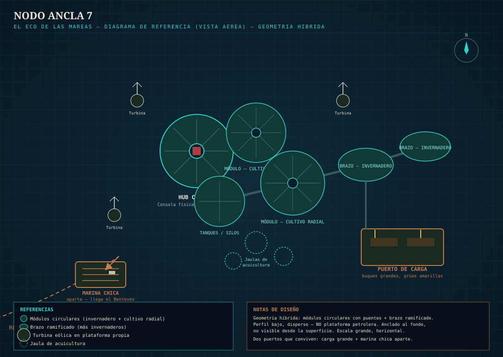

# Escenografía — Nodo Ancla 7
### MESA CHICA — parte del documento de escenografías del tráiler

**Regla de look fijo:** todos los prompts de referencia incluyen, palabra por palabra, el mismo bloque de cámara/luz que usamos en el resto del proyecto — lente anamórfico 35mm, paleta teal y cobre, niebla volumétrica, ARRI Alexa 35, 4K. Nunca generar una escenografía sin ese bloque.

**Regla de bioluminiscencia:** el brillo bioluminiscente teal es exclusivo del **Nodo Ancla 7** y sus alrededores inmediatos. No aparece en la costa, la casa, ni el puerto.

---

**Geometría:** mezcla de dos formas — una zona central de **varios módulos circulares grandes** (cada uno con un domo/lattice de invernadero y un patrón radial de cultivo adentro, con una torre-espiga central), conectados entre sí por **puentes/pasarelas**; y además **uno o dos brazos alargados** que se ramifican hacia afuera desde esa zona central, con más invernaderos e infraestructura, dándole al conjunto una silueta más orgánica y extendida en el agua (no todo son círculos prolijos, hay una parte que se estira).

**Propuesta:**
- Estructura **grande pero de perfil bajo** — nunca una sola torre alta; el complejo se esparce sobre una zona amplia del mar (varios cientos de metros). Grande en escala horizontal, no vertical — sigue dando la sensación de flotar sobre el agua (aunque en realidad está anclado al fondo marino con cables/fundaciones que no se ven desde la superficie).
- **Invernaderos con domo tipo lattice** (estructura triangulada blanca, vidrio/ETFE) sobre cada módulo circular, con cultivos dispuestos en anillos radiales alrededor de una torre-espiga central — no es un cultivo desordenado, tiene un diseño geométrico prolijo.
- **Turbinas eólicas** montadas en plataformas flotantes propias, separadas de los módulos principales — parte del sistema de energía del Nodo.
- **Jaulas de acuicultura circulares** (peces, no solo algas) flotando en el agua entre los módulos, además de las líneas de cultivo de algas/kelp.
- **Tanques de almacenamiento / silos** en alguno de los módulos — infraestructura de procesamiento, no solo cultivo.
- Un núcleo/hub central apenas elevado (unos pocos metros sobre el agua) donde está la consola física que Mateo y Clara tienen que alcanzar.
- **Dos puertos distintos, que conviven:**
  1. **Puerto de carga grande** — muelles donde atracan buques de carga/contenedores de verdad, con grúas amarillas de carga. Es donde se distribuye la producción del Nodo al resto del mundo.
  2. **Marina chica aparte** — un muelle flotante más pequeño y apartado, con pantalanes y defensas de atraque, pensado para embarcaciones de mantenimiento y el Benteveo. No es el mismo lugar que el puerto de carga — está en otra zona del complejo, más tranquila.
- **La bioluminiscencia teal vive acá** — en los módulos de cultivo (algas, coral, pasto marino) y en el agua alrededor de toda la estructura. Es la firma visual del Nodo.
- **De día, con todo funcionando bien:** tiene que verse lindo, casi idílico — los domos brillando al sol, el patrón radial de los cultivos, luz reflejando en el agua entre los módulos, el brillo turquesa asomando incluso de día bajo la superficie.
- **De noche/en la tormenta:** la misma estructura se vuelve amenazante — luces de advertencia rojas parpadeando, expuesta a los rayos, el brillo teal ahora contrastando con el rojo de alerta.

**Diagrama de referencia ya armado** (ver imagen abajo) — muestra la zona de módulos circulares, el brazo ramificado, el hub central, los dos puertos, y las turbinas.



**Prompt de referencia (día, todo bien):**
```
Wide aerial shot of Anchor Node 7 at golden daylight — a large but low-profile floating platform 
complex, NOT shaped like an oil rig (no tall derrick or drilling tower silhouette). A cluster of 
large circular floating modules, each covered by a white lattice-frame greenhouse dome with 
crops arranged in radial rings around a central spire, connected to each other by bridges. One 
or two elongated branching arms extend outward from the cluster with more greenhouse 
structures, giving the whole complex an organic, spread-out silhouette. Freestanding wind 
turbines rise from smaller floating platforms nearby. Circular aquaculture cages with fish float 
in the water between the modules, alongside rows of kelp farming lines. Storage tanks and silos 
sit on one of the modules. A large cargo harbor with big container ships and yellow loading 
cranes occupies one side of the complex; a smaller, quieter marina with floating docks and 
mooring fenders sits apart from it. The whole structure appears to float on the surface, 
anchored to the seabed by unseen cables. Bioluminescent teal glow visible faintly under the 
water even in daylight. Sunlight glints off wet platforms. Beautiful harmony between technology 
and nature, wide establishing shot, photorealistic.

Anamorphic 35mm lens, moody cinematic lighting, teal and copper color palette, volumetric fog 
and atmospheric haze, subtle horizontal blue lens flares, oval bokeh, shot on ARRI Alexa 35, 
2.39:1 widescreen look, subtle film grain, natural skin tones, 4K photorealistic detail, high 
dynamic range.
```

**Prompt de referencia (noche/tormenta):**
```
The same Anchor Node 7 complex at night during the synthetic storm — the cluster of circular 
greenhouse-domed modules and the branching arm, still low-profile, still NOT shaped like an oil 
rig. Red warning lights flash across the structure, lightning strikes illuminate the wet platforms 
and the wind turbines, powerful wind whips the water between the modules and the aquaculture 
cages. The bioluminescent teal glow of the farm modules and the quiet marina contrasts against 
the flashing red alerts near the cargo harbor. The central hub's lights flicker from teal to red. 
Ominous transformation of the same beautiful daytime location, wide establishing shot, 
photorealistic.

Anamorphic 35mm lens, moody cinematic lighting, teal and copper color palette, volumetric fog 
and atmospheric haze, subtle horizontal blue lens flares, oval bokeh, shot on ARRI Alexa 35, 
2.39:1 widescreen look, subtle film grain, natural skin tones, 4K photorealistic detail, high 
dynamic range.
```

---
