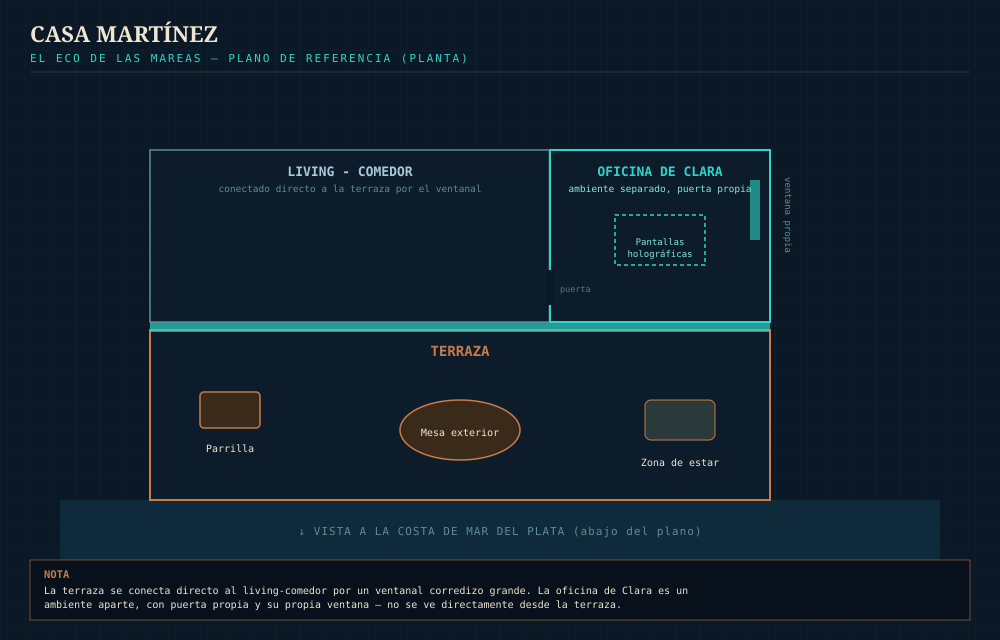

# Escenografías — El Eco de las Mareas
### MESA CHICA — documento de referencia único para todas las locaciones del tráiler

Este archivo define cómo se ve cada escenografía, independiente de qué personajes aparezcan en ella. Una vez que cada locación esté cerrada, los prompts de personajes-en-contexto (en `prompts_dobles_por_plano.md`) tienen que usar exactamente estas descripciones, no inventar variantes nuevas escena por escena.

**Regla de look fijo:** todos los prompts de referencia de este documento incluyen, palabra por palabra, el mismo bloque de cámara/luz que usamos en el resto del proyecto — lente anamórfico 35mm, paleta teal y cobre, niebla volumétrica, ARRI Alexa 35, 4K. Nunca generar una escenografía sin ese bloque.

**Regla de bioluminiscencia:** el brillo bioluminiscente teal es una firma visual exclusiva del **Nodo Ancla 7** y sus alrededores inmediatos. NO aparece cerca de la costa de Mar del Plata, ni en la terraza de la casa, ni en el puerto de la ciudad — esos lugares tienen luz e iluminación normal, sin ningún brillo submarino. Es una forma de que, apenas se ve ese brillo turquesa en cualquier plano, el espectador entienda "estamos cerca del Nodo", sin necesidad de decirlo.

---

## 1. Nodo Ancla 7

**Geometría:** mezcla de dos formas — una zona central de **varios módulos circulares grandes** (cada uno con un domo/lattice de invernadero y un patrón radial de cultivo adentro, con una torre-espiga central), conectados entre sí por **puentes/pasarelas**; y además **uno o dos brazos alargados** que se ramifican hacia afuera desde esa zona central, con más invernaderos e infraestructura, dándole al conjunto una silueta más orgánica y extendida en el agua (no todo son círculos prolijos, hay una parte que se estira).

**Propuesta:**
- Estructura **grande pero de perfil bajo** — nunca una sola torre alta; el complejo se esparce sobre una zona amplia del mar (varios cientos de metros). Grande en escala horizontal, no vertical — sigue dando la sensación de flotar sobre el agua (aunque en realidad está anclado al fondo marino con cables/fundaciones que no se ven desde la superficie).
- **Invernaderos con domo tipo lattice** (estructura triangulada blanca, vidrio/ETFE) sobre cada módulo circular, con cultivos dispuestos en anillos radiales alrededor de una torre-espiga central — no es un cultivo desordenado, tiene un diseño geométrico prolijo.
- **Turbinas eólicas** montadas en plataformas flotantes propias, separadas de los módulos principales — parte del sistema de energía del Nodo.
- **Jaulas de acuicultura circulares** (peces, no solo algas) flotando en el agua entre los módulos, además de las líneas de cultivo de algas/kelp.
- **Tanques de almacenamiento / silos** en alguno de los módulos — infraestructura de procesamiento, no solo cultivo.
- Un núcleo/hub central apenas elevado (unos pocos metros sobre el agua) donde está la consola física que Mateo y Clara tienen que alcanzar.
- **Dos puertos distintos, que conviven:**
  1. **Puerto de carga grande** — muelles donde atracan buques de carga/contenedores de verdad, con grúas amarillas de carga. Es donde se distribuye la producción del Nodo al resto del mundo.
  2. **Marina chica aparte** — un muelle flotante más pequeño y apartado, con pantalanes y defensas de atraque, pensado para embarcaciones de mantenimiento y el Benteveo. No es el mismo lugar que el puerto de carga — está en otra zona del complejo, más tranquila.
- **La bioluminiscencia teal vive acá** — en los módulos de cultivo (algas, coral, pasto marino) y en el agua alrededor de toda la estructura. Es la firma visual del Nodo.
- **De día, con todo funcionando bien:** tiene que verse lindo, casi idílico — los domos brillando al sol, el patrón radial de los cultivos, luz reflejando en el agua entre los módulos, el brillo turquesa asomando incluso de día bajo la superficie.
- **De noche/en la tormenta:** la misma estructura se vuelve amenazante — luces de advertencia rojas parpadeando, expuesta a los rayos, el brillo teal ahora contrastando con el rojo de alerta.

**Diagrama de referencia ya armado** (ver imagen abajo) — muestra la zona de módulos circulares, el brazo ramificado, el hub central, los dos puertos, y las turbinas.


**Prompt de referencia (día, todo bien):**
```
Wide aerial shot of Anchor Node 7 at golden daylight — a large but low-profile floating platform 
complex, NOT shaped like an oil rig (no tall derrick or drilling tower silhouette). A cluster of 
large circular floating modules, each covered by a white lattice-frame greenhouse dome with 
crops arranged in radial rings around a central spire, connected to each other by bridges. One 
or two elongated branching arms extend outward from the cluster with more greenhouse 
structures, giving the whole complex an organic, spread-out silhouette. Freestanding wind 
turbines rise from smaller floating platforms nearby. Circular aquaculture cages with fish float 
in the water between the modules, alongside rows of kelp farming lines. Storage tanks and silos 
sit on one of the modules. A large cargo harbor with big container ships and yellow loading 
cranes occupies one side of the complex; a smaller, quieter marina with floating docks and 
mooring fenders sits apart from it. The whole structure appears to float on the surface, 
anchored to the seabed by unseen cables. Bioluminescent teal glow visible faintly under the 
water even in daylight. Sunlight glints off wet platforms. Beautiful harmony between technology 
and nature, wide establishing shot, photorealistic.

Anamorphic 35mm lens, moody cinematic lighting, teal and copper color palette, volumetric fog 
and atmospheric haze, subtle horizontal blue lens flares, oval bokeh, shot on ARRI Alexa 35, 
2.39:1 widescreen look, subtle film grain, natural skin tones, 4K photorealistic detail, high 
dynamic range.
```

**Prompt de referencia (noche/tormenta):**
```
The same Anchor Node 7 complex at night during the synthetic storm — the cluster of circular 
greenhouse-domed modules and the branching arm, still low-profile, still NOT shaped like an oil 
rig. Red warning lights flash across the structure, lightning strikes illuminate the wet platforms 
and the wind turbines, powerful wind whips the water between the modules and the aquaculture 
cages. The bioluminescent teal glow of the farm modules and the quiet marina contrasts against 
the flashing red alerts near the cargo harbor. The central hub's lights flicker from teal to red. 
Ominous transformation of the same beautiful daytime location, wide establishing shot, 
photorealistic.

Anamorphic 35mm lens, moody cinematic lighting, teal and copper color palette, volumetric fog 
and atmospheric haze, subtle horizontal blue lens flares, oval bokeh, shot on ARRI Alexa 35, 
2.39:1 widescreen look, subtle film grain, natural skin tones, 4K photorealistic detail, high 
dynamic range.
```

---

## 2. Costa de Mar del Plata

**Propuesta:**
- Playa principal de Mar del Plata (Playa Bristol) — costa de arena plana, SIN acantilados. El Hotel Provincial y el Casino Central (edificio emblemático de estilo afrancesado, ladrillo a la vista y piedra clara, techos de pizarra tipo mansarda) se ven bien prominentes sobre el frente costero, conviviendo con arquitectura nueva de 2065 (curvas, vidrio, techos verdes) más atrás en el perfil de la ciudad.
- **Sin bioluminiscencia** — esta locación tiene iluminación urbana y natural normal. El brillo teal es exclusivo del Nodo Ancla 7, a 100km de la costa; acá no se ve.

**Prompt de referencia:**
```
Wide aerial establishing shot of Mar del Plata's main beach (Playa Bristol) at dusk, 2065 — a 
flat sandy coastline, NO cliffs. The Hotel Provincial and Casino Central stand prominently along 
the beachfront: a French Second Empire-style building complex with red brick, cream stone trim, 
and dark mansard roofs. New organic 2065 architecture 
— curved glass, green rooftops — blends into the skyline further back. City lights beginning to 
glow against a soft dusk sky, calm sea in the foreground. Normal warm light, no bioluminescent 
glow anywhere. Cinematic aerial wide shot, photorealistic.

Anamorphic 35mm lens, moody cinematic lighting, teal and copper color palette, volumetric fog 
and atmospheric haze, subtle horizontal blue lens flares, oval bokeh, shot on ARRI Alexa 35, 
2.39:1 widescreen look, subtle film grain, natural skin tones, 4K photorealistic detail, high 
dynamic range.
```

---

## 3. Casa Martínez

### 3.1 — Exterior: la terraza
- Terraza con vista a la costa, con parrilla y mesa exterior — sin acantilados, la casa está sobre un edificio de buena altura, no sobre un risco natural.
- De fondo, la costa de Mar del Plata (ver locación 2) — sin bioluminiscencia, solo la ciudad y el mar normal.

**Prompt de referencia:**
```
Sunlit rooftop terrace of the Martínez family home, several floors up with an open view over 
Mar del Plata's flat sandy coastline — no cliffs. A barbecue 
grill and an outdoor dining table with chairs. Warm, lived-in, modern-but-cozy furniture. Behind 
the terrace railing, the Mar del Plata coastline is visible in the distance — classic landmark 
buildings mixed with 2065 architecture. Normal bright warm daylight, no bioluminescent glow 
anywhere — that signature belongs only to Anchor Node 7, far offshore. Photorealistic, shallow 
depth of field.

Anamorphic 35mm lens, moody cinematic lighting, teal and copper color palette, volumetric fog 
and atmospheric haze, subtle horizontal blue lens flares, oval bokeh, shot on ARRI Alexa 35, 
2.39:1 widescreen look, subtle film grain, natural skin tones, 4K photorealistic detail, high 
dynamic range.
```

### 3.2 — Interior: el sector de trabajo de Clara
- Un rincón/oficina dentro de la casa, distinto del living o la cocina, con la terminal de pantallas holográficas transparentes donde Clara monitorea la red A.Q.U.A.
- **Resuelto:** la terraza se conecta al living-comedor por un gran ventanal corredizo. La oficina de Clara es un ambiente separado con puerta propia, aunque tiene su propia ventana — ver diagrama abajo.



**Prompt de referencia:**
```
A small home office nook inside the Martínez house, warm wood and soft daylight from a nearby 
window. Clara's workstation: several transparent holographic screens floating in the air, 
displaying green A.Q.U.A. network graphs and data. Minimalist, calm, organized space. No 
bioluminescent glow — the holographic screens are the only glowing element in this room. 
Photorealistic, soft interior lighting.

Anamorphic 35mm lens, moody cinematic lighting, teal and copper color palette, volumetric fog 
and atmospheric haze, subtle horizontal blue lens flares, oval bokeh, shot on ARRI Alexa 35, 
2.39:1 widescreen look, subtle film grain, natural skin tones, 4K photorealistic detail, high 
dynamic range.
```

---

## 4. Puerto de Mar del Plata

**Propuesta:**
- Sin la flota de barcos pesqueros típica de hoy — A.Q.U.A. hizo que la pesca tradicional ya no sea tan necesaria.
- Sí puede haber un sector tipo **"museo de puerto"**, con algunos barcos pesqueros clásicos preservados como pieza histórica/turística — un guiño a lo que el puerto solía ser.
- El resto del puerto: muelles modernos, embarcaciones automatizadas (las que quedan paralizadas por el bloqueo en la Escena 04), y el Benteveo como una de las pocas embarcaciones con mandos mecánicos.
- **Sin bioluminiscencia** — este puerto está en la costa, no cerca del Nodo.

**Prompt de referencia:**
```
Wide shot of the modern Mar del Plata port in 2065. Sleek automated maintenance vessels are 
docked at clean modern piers — no traditional fishing fleet. Off to one side, a small "harbor 
museum" area preserves a few classic wooden fishing boats as a historical display. The 
Benteveo — a 30-foot modern planing-hull sailboat with a white fiberglass hull, 40 years old but 
lovingly maintained, registration "620772" near the bow — stands out among the automated 
vessels. Bright normal morning light, no bioluminescent glow anywhere in this shot. 
Photorealistic, wide establishing shot.

Anamorphic 35mm lens, moody cinematic lighting, teal and copper color palette, volumetric fog 
and atmospheric haze, subtle horizontal blue lens flares, oval bokeh, shot on ARRI Alexa 35, 
2.39:1 widescreen look, subtle film grain, natural skin tones, 4K photorealistic detail, high 
dynamic range.
```

---

## 5. El Benteveo (por dentro y por fuera)

Ya documentado en detalle en `ficha_benteveo.md` — acá solo el resumen para escenografía:

- **Afuera:** bañera abierta a popa (timón moderno, consola con instrumentos mixtos analógico/holográficos), cubierta de composite con acentos de teca, casco de fibra blanco prolijamente mantenido, matrícula "620772" cerca de la proa.
- **Adentro (bajo cubierta):** cabina chica con paneles de madera cálidos, dos camarotes, cocina con hornillo a gardán, baño con inodoro marino — acá vive el baúl del abuelo Vicente con el mapa y las fotos.
- Sin bioluminiscencia propia — si el Benteveo está cerca del Nodo, puede reflejar el brillo teal del agua alrededor; en cualquier otra locación, no.

**Resuelto con el plano real del barco (uso interno, nunca nombrar la marca en prompts):** de proa a popa — camarote de proa (cama en V), pasillo con baño a un lado, salón principal con mesa central y sofás a los costados (acá vive el baúl del abuelo Vicente), cocina chica cerca de la escalera de acceso a cubierta, y dos camarotes más a popa, bajo la bañera.

**Prompt de referencia (interior general, salón):**
```
Interior of the Benteveo's main cabin salon, warm wood paneling throughout, natural light 
filtering through a deck hatch above. A central dining table with bench seating on both sides, 
built-in wooden cabinetry. A small galley nook visible near the companionway stairs leading up 
to the cockpit. Lived-in, 40 years of family history — charts, tools, and personal objects tucked 
into shelves. Cozy, warm, intimate space, photorealistic, soft interior lighting.

Anamorphic 35mm lens, moody cinematic lighting, teal and copper color palette, volumetric fog 
and atmospheric haze, subtle horizontal blue lens flares, oval bokeh, shot on ARRI Alexa 35, 
2.39:1 widescreen look, subtle film grain, natural skin tones, 4K photorealistic detail, high 
dynamic range.
```

---

## 6. El mar / la tormenta sintética

**Propuesta:**
```
Synthetic electrical storm over the open South Atlantic, near Anchor Node 7 — dominated by 
powerful wind and frequent, dramatic lightning strikes, NOT heavy rain. Wind whips the water 
into sharp chop and sends spray flying sideways off the wave tops. Sails and loose rigging snap 
taut in the gusts. Occasional light spray or mist in the air, but no heavy downpour. Dark, 
dramatic sky lit by constant lightning flicker. The bioluminescent teal glow of the Node's farm 
modules cuts through the darkness in the distance. Photorealistic, cinematic.

Anamorphic 35mm lens, moody cinematic lighting, teal and copper color palette, volumetric fog 
and atmospheric haze, subtle horizontal blue lens flares, oval bokeh, shot on ARRI Alexa 35, 
2.39:1 widescreen look, subtle film grain, natural skin tones, 4K photorealistic detail, high 
dynamic range.
```

---

## Estado — todo resuelto

1. ✅ Interior de la cabina del Benteveo — resuelto con las fotos y planos reales del barco (ver sección 5).
2. ✅ Cierre (Escena 09) sin huertas bioluminiscentes pegadas al barco — se ajustó para que se vean como un brillo distante en el horizonte, marcando de dónde viene la familia.
3. ✅ Diagrama y diseño del Nodo Ancla 7 — geometría híbrida confirmada (módulos circulares + brazo ramificado), con los dos puertos.
4. ✅ Plano de la casa Martínez — terraza conectada al living por ventanal, oficina de Clara aparte.
5. ✅ Tormenta corregida a viento fuerte + rayos, sin lluvia pesada.

No queda ningún pendiente de escenografía sin resolver.
