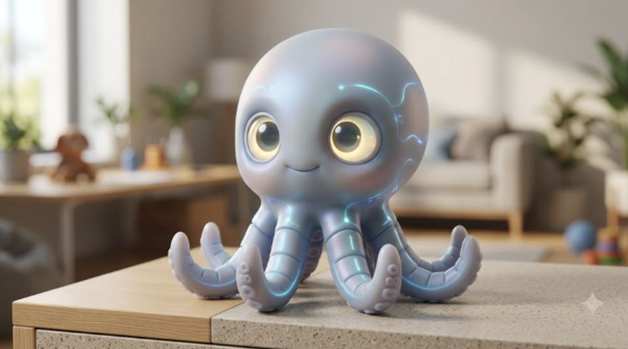

# Alfi — Ficha de personaje
### El Eco de las Mareas / The Echo of the Tides — MESA CHICA

Este archivo se va actualizando cada vez que definimos algo nuevo sobre Alfi. Documento de referencia único para generación de imágenes/video.

---


*Diseño de referencia subido por el equipo.*

## Datos básicos

- **Nombre:** Alfi
- **Rol en la historia:** mascota robótica de nanotecnología de Sofía Martínez (9). Funciona además como el asistente doméstico inteligente de la familia — el equivalente a un "Google Home" físico y con forma de mascota.
- **Dueña:** Sofía Martínez.

## Apariencia física — forma base (pulpo)

Cuerpo de pulpo pequeño, tamaño de palma de mano, diseño redondeado y amigable (estética "personaje entrañable", no robot frío). Caparazón liso color lavanda-gris pálido, con un brillo suave nacarado. Ojos grandes, redondos, expresivos, de color ámbar/dorado con pupila oscura — es el rasgo que más transmite personalidad y emoción. Estrías finas de luz azul bioluminiscente recorren los tentáculos y partes del cuerpo, pulsando suavemente cuando está "escuchando" o activo. Sonrisa simple y sutil.

## Habilidad — asistente doméstico con forma de mascota

Alfi funciona con comandos de voz, como un altavoz inteligente, pero con cuerpo físico y personalidad propia:

- Ejemplos de comandos: "Alfi, apagá las luces", "Alfi, decile a los drones que pongan la mesa", "Alfi, ¿cómo está el clima para navegar?"
- Controla dispositivos domésticos de la casa Martínez y del Benteveo (luces, drones domésticos, electrodomésticos conectados).
- Es percibido por los adultos como "un juguete" — lo cual termina siendo clave narrativa, porque nadie espera que su tecnología lúdica resuelva una crisis real.

## Habilidad especial — transformación (metamorfosis controlada)

Alfi puede cambiar de forma y adoptar la apariencia de otros animales, manteniendo siempre dos elementos fijos como "firma visual" de identidad — sin importar en qué animal se transforme, siempre se lo reconoce como Alfi:

1. **Los ojos:** siempre grandes, redondos, ámbar/dorados con pupila oscura, expresivos — nunca cambian de forma ni de color, sin importar el animal.
2. **Las estrías azules bioluminiscentes:** el patrón de líneas de luz azul turquesa que recorre el cuerpo se mantiene en cualquier forma, adaptado a la anatomía del nuevo animal (por ejemplo, a lo largo del lomo si es un delfín, o de las alas si fuera un ave).

El resto del diseño (textura, forma del cuerpo, tamaño) se adapta al animal en cuestión, pero conservando la estética general: redondeada, suave, amigable, nunca amenazante ni hiperrealista — siempre lee como "personaje", no como animal real.

**Forma usada en el clímax:** Alfi puede adoptar rasgos de cetáceo (delfín/ballena) para emitir su señal y comunicarse con la fauna marina real durante el rescate en el Nodo Ancla 7 — coherente con la idea original de "hablar el idioma del mar".

## Notas visuales de la ficha oficial

- Diseño tipo personaje de animación 3D de alta calidad (estética Pixar/Disney moderna), no robot mecánico duro.
- Superficies suaves, redondeadas, sin bordes filosos.
- Iluminación cálida de interior en las fotos de referencia — coherente con que vive en la casa/el barco de la familia.

## Prompts de imagen ya generados (por escena del tráiler)

Ver `prompts_imagenes_el_eco_de_las_mareas.md` y `prompts_dobles_por_plano.md` — todas las escenas donde aparece Alfi (en su forma pulpo) usan el descriptor fijo: "Alfi (a palm-sized nanotech pet robot, smooth pale lavender-grey shell, large round amber eyes with dark pupils, glowing teal-blue bioluminescent seams)".

**Nota:** en los prompts existentes, Alfi todavía aparece descripto de forma más simple ("smooth pale shell, glowing teal-blue seams") — conviene actualizarlos con la descripción completa de ojos ámbar y el resto de los detalles de esta ficha la próxima vez que se toquen esos archivos.

## Prompts de prueba

### 1. Retrato — forma pulpo (base)
```
Portrait shot of Alfi, a palm-sized nanotech pet robot in octopus form. Smooth pale 
lavender-grey shell with a soft pearlescent sheen, rounded friendly Pixar-style design. Large 
round amber-gold eyes with dark pupils, warm and expressive, small subtle smile. Thin glowing 
teal-blue bioluminescent seams running along the tentacles and body, pulsing softly. Sitting on 
a wooden surface, warm indoor lighting, shallow depth of field, photorealistic 3D character 
render quality.
```

### 2. Transformación — forma cetáceo (para el clímax)
```
Alfi, the nanotech pet robot, shown mid-transformation into a small dolphin-like form — smooth 
pale lavender-grey body, streamlined and rounded, friendly character design (not a realistic 
dolphin). The same large round amber-gold eyes with dark pupils are preserved, unmistakably 
Alfi. Thin glowing teal-blue bioluminescent seams run along its back and fin, pulsing with light 
as it emits an acoustic signal underwater. Dark ocean background lit by the blue glow, 
photorealistic 3D character render quality, cinematic.
```

### 3. Detalle — ojos y estrías
```
Extreme close-up macro shot of Alfi's face: large round amber-gold eyes with dark pupils, 
smooth pale lavender-grey shell, thin glowing teal-blue bioluminescent seam visible along the 
edge of the frame, pulsing softly. Warm soft lighting, photorealistic 3D character render detail.
```

## Ficha para Google Flow (formato compacto)

```
Nombre: Alfi
Rol: Mascota robótica de nanotecnología de Sofía Martínez (9). También funciona como asistente
doméstico inteligente de la familia, controlado por voz.

Apariencia física (forma base, pulpo): cuerpo redondeado tamaño de mano, caparazón liso
lavanda-gris pálido con brillo nacarado. Ojos grandes, redondos, ámbar/dorados con pupila
oscura. Estrías finas de luz azul bioluminiscente en los tentáculos, que pulsan suavemente.
Diseño amigable estilo personaje de animación 3D, nunca robot frío o amenazante.

Habilidad especial: puede transformarse en otros animales (por ejemplo, forma de cetáceo)
manteniendo siempre los mismos ojos ámbar y el patrón de estrías azules bioluminiscentes como
firma visual fija, sin importar la forma que adopte.

Contexto narrativo: los adultos lo ven como un juguete, pero es la clave técnica y emocional que
resuelve el conflicto final de la película.
```
