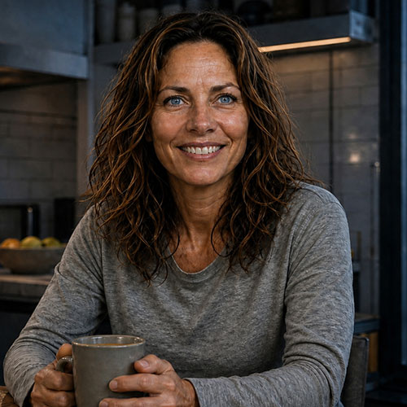
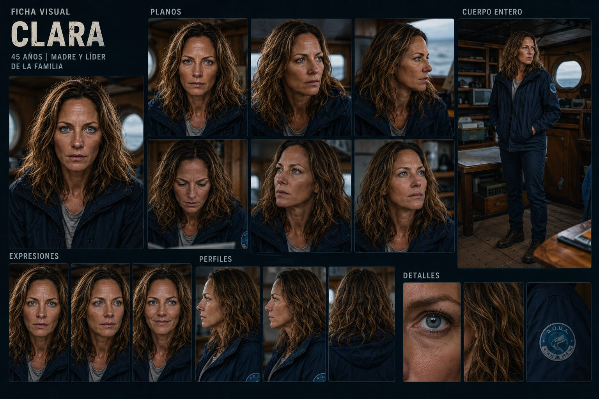

# Clara Martínez — Ficha de personaje
### El Eco de las Mareas / The Echo of the Tides — MESA CHICA

Este archivo se va actualizando cada vez que definimos algo nuevo sobre Clara. Es el documento de referencia único para ella — para generación de imágenes, voz, o cualquier herramienta (incluido Google Flow).

---


*Ficha visual de referencia subida por el equipo.*


*Ficha visual completa de Clara (referencia del equipo) — ficha completa con perfiles, expresiones, cuerpo entero y detalles.*

## Datos básicos

- **Nombre completo:** Clara Vicente Martínez (el segundo nombre es en honor a su padre)
- **Edad:** 42 años
- **Rol en la historia:** Madre y líder de la familia. Bióloga marina y Supervisora de Campo de A.Q.U.A. en el sector del Mar Argentino.
- **Familia:** Esposa de Tomás Martínez (45). Madre de Mateo (15) y Sofía (9). Hija del Dr. Vicente Olivera (oceanógrafo, fallecido).
- **Habilidad:** capacidad excepcional de análisis ecosistémico y diagnóstico predictivo en tiempo real — interpreta anomalías en la biomasa marina antes de que las lean los sensores estándar.
- **Debilidad:** perfeccionismo y tendencia a sobrecargarse de responsabilidad, lo que le dificulta delegar cuando la crisis supera el plano científico.
- **Rol en el conflicto / resolución:** es la líder táctica de la misión. Detecta el hackeo en el Nodo Ancla 7, calcula el tiempo crítico de colapso térmico, decide el desvío del navío hacia el peligro y guía a Mateo en la inyección del código abierto para reiniciar la red.

## Apariencia física

Pelo castaño ondulado con reflejos claros, largo hasta debajo de los hombros. Ojos celeste-grisáceos claros. Piel con buen color por el sol, sin arrugas marcadas — aparenta los 42 años que tiene, no más. Contextura media, postura firme y erguida.

**Vestuario habitual:** campera azul marino, sobre una remera/camisa gris, pantalón oscuro, botas de trabajo. El parche circular de "A.Q.U.A." bordado en la manga NO es un elemento fijo — aparece solo ocasionalmente, en contextos de trabajo/servicio (ej. en la terminal, o en escenas donde se refuerza su rol oficial), no en todas las apariciones.

### Estados a lo largo de la película (progresión física)

Igual que con Tomás — prolija al principio, cada vez más desaliñada a medida que avanza la tormenta. Usar el descriptor que corresponda según la escena.

**Estado prolijo (escenas 1 a 4 — asado, zarpando, el bloqueo):**
```
Hair neatly brushed or loosely tied back, calm composed expression, clean and slightly pressed
navy jacket, relaxed confident posture.
```

**Estado desaliñado (escenas 5 a 9 — motor de repuesto, tormenta, cerco, clímax, regreso):**
```
Wind-blown, rain-soaked hair sticking to her face, damp jacket, exhausted but determined
expression, sleeves pushed up, a few loose strands across her forehead.
```

## Personalidad

Calma, reflexiva, autoritaria sin ser dura. Piensa antes de reaccionar, incluso bajo presión — es quien sostiene emocionalmente a la familia durante la crisis. Protectora, técnica, con un vínculo profundo y heredado con el mar.

- **Qué quiere (objetivo externo):** proteger el Nodo Ancla 7 y la biodiversidad del Mar Argentino; que el sistema que ayudó a construir no caiga en manos corporativas.
- **Qué necesita (arco interno):** confiar en que su familia puede funcionar como equipo cohesionado ante una crisis real.
- **Relación con la tecnología:** la respeta como herramienta viva, no como un fin en sí mismo.

## Backstory / contexto narrativo

Hija del Dr. Vicente Olivera, célebre oceanógrafo de la expedición del Falkor (Too) en 2025 al Talud Continental IV. Vicente trabajó después en Vortex Corp, pero renunció al descubrir que la corporación pretendía sabotear la paz de 2030 para privatizar los alimentos. Dejó a la familia mapas oceanográficos físicos y el Benteveo. Clara honra su memoria en su trabajo diario con A.Q.U.A.

## Voz

**Perfil base:** registro medio-grave, cálido, acento rioplatense neutro. Cadencia pausada por defecto, autoridad natural de alguien acostumbrada a explicar cosas complejas con calma. Voz de bióloga y de madre a la vez — nunca aguda ni impostada.

### Registro 1 — Narradora (prólogo, 0:00–0:20)
```
Female voice, 42 years old, neutral Rioplatense Spanish accent. Reflective trailer-narrator
tone, slow deliberate pace with long pauses between phrases, as if she already knows how
the story ends. Warm but authoritative, mid-low register with chest resonance. Minimal
inflection, almost meditative. Stability: high. Style exaggeration: low.
```
Línea: *"En 2030, la humanidad entendió que el hambre no se vencía compitiendo... sino abriendo el conocimiento al mar. Sin colaboración la garantía de supervivencia podría fallar."*

### Registro 2 — Doméstica (el asado, 0:20–0:45)
```
Female voice, 42 years old, neutral Rioplatense Spanish accent. Relaxed, warm, domestic tone,
smiling audibly, natural brightness, playful with family. Faster, looser pace than the narrator
version, casual home-life cadence. Stability: medium. Style exaggeration: medium.
```
Línea: *"Todo en orden en A.Q.U.A. Fin de semana activado... ¿Quién está listo para navegar?"*

### Registro 3 — Crisis controlada (el bloqueo, 1:00–1:30)
```
Female voice, 42 years old, neutral Rioplatense Spanish accent. Controlled tension — worry
that has NOT broken into panic. Faster pace, shorter sentences, clipped delivery, but still
grounded. Chest resonance stays present even under stress. Stability: medium-low. Style
exaggeration: medium-high.
```
Líneas: *"No hay señal satelital... El Nodo 7 se está recalentando. ¿Cómo puede ser?" / "El drone es de VORTEX... Es un sabotaje." / "¡Si no reiniciamos la plataforma en diez minutos, las huertas oceánicas colapsarán y el hambre volverá!"*

### Registro 4 — Íntima (el recuerdo del padre, 1:50–2:05)
```
Female voice, 42 years old, neutral Rioplatense Spanish accent. Quiet, intimate, nostalgic but
restrained — she does not cry, she remembers. Volume drops, pace slows further than even
the narrator version. Slight vulnerability under the steadiness. Stability: high. Style
exaggeration: low, but with subtle emotional weight in pitch contour.
```
Línea: *"Papá conocía este mar como nadie. Lo entendía. Sabía que el camino del futuro era por aquí si aprendíamos a respetarlo. En aquel entonces, Vortex ya tenía otros planes."*

### Registro 5 — Grito físico (el clímax, 2:20–2:45)
```
Female voice, 42 years old, neutral Rioplatense Spanish accent. Raw shout under physical
strain — rain, wind, adrenaline — not a clean studio-style yell. Urgent, full-chest projection,
slight vocal roughness from effort, but diction must stay intelligible. Stability: low. Style
exaggeration: high.
```
Línea: *"¡Es ahora!"*

## Prompts de imagen ya generados (por escena del tráiler)

Ver `prompts_imagenes_el_eco_de_las_mareas.md` — todas las escenas donde aparece Clara usan el descriptor fijo: *"Clara Martínez (42, wavy chestnut-brown hair, light blue-grey eyes, navy jacket)"*. El parche de A.Q.U.A. se agrega solo en algunas escenas puntuales, no como rasgo fijo.

## Prompts de prueba — planos individuales para testear el personaje

Todos parten del mismo descriptor fijo para no perder consistencia entre pruebas.

### 1. Retrato neutro (base)
```
Portrait shot, front-facing, neutral expression. Clara Martínez, 42 years old, wavy chestnut-brown
hair with lighter highlights past her shoulders, light blue-grey eyes, sun-kissed skin,
wearing a navy blue jacket over a grey shirt. Soft
even lighting, wooden boat cabin interior background, softly blurred. Photorealistic, shallow
depth of field, 85mm portrait lens.
```

### 2. Perfil 3/4
```
Three-quarter profile shot of Clara Martínez (42, wavy chestnut-brown hair, light blue-grey eyes,
sun-kissed skin, navy jacket). Calm, composed
expression, looking slightly off-camera toward the ocean light through a porthole. Photorealistic,
natural daylight, 85mm lens.
```

### 3. Perfil de costado
```
Full side profile shot of Clara Martínez (42, wavy chestnut-brown hair, light blue-grey eyes,
sun-kissed skin, navy jacket), against a plain neutral background.
Photorealistic, even studio-style lighting, sharp focus on facial structure.
```

### 4. Espalda / detalle de pelo
```
Back-of-head shot of Clara Martínez showing her wavy chestnut-brown hair with lighter highlights,
past-shoulder length, slightly wind-blown. Navy jacket visible on shoulders. Soft natural light,
photorealistic, shallow depth of field.
```

### 5. Expresión — preocupación / concentración
```
Close-up portrait of Clara Martínez (42, wavy chestnut-brown hair, light blue-grey eyes, sun-kissed
skin, navy jacket), brow slightly furrowed, focused and worried expression,
studying something off-frame. Dim interior boat lighting, cool blue-grey tones, photorealistic,
cinematic close-up.
```

### 6. Expresión — sonrisa cálida
```
Close-up portrait of Clara Martínez (42, wavy chestnut-brown hair, light blue-grey eyes, sun-kissed
skin, navy jacket), warm relaxed smile, soft eyes, natural laugh lines. Bright
daylight, warm color temperature, photorealistic, shallow depth of field.
```

### 7. Expresión — determinación firme
```
Close-up portrait of Clara Martínez (42, wavy chestnut-brown hair, light blue-grey eyes, sun-kissed
skin, navy jacket), steely determined expression, jaw set, direct intense
gaze into camera. Dramatic side lighting, stormy blue-grey backdrop, photorealistic, cinematic.
```

### 8. Expresión — nostalgia contenida
```
Close-up portrait of Clara Martínez (42, wavy chestnut-brown hair, light blue-grey eyes, sun-kissed
skin, navy jacket), soft nostalgic expression, eyes slightly downcast,
looking at something in her hands just out of frame (an old photograph). Warm low lamplight,
intimate mood, photorealistic, shallow depth of field.
```

### 9. Cuerpo entero — al timón
```
Full body shot of Clara Martínez (42, wavy chestnut-brown hair, light blue-grey eyes, sun-kissed
skin, navy jacket, dark trousers, boots) standing firmly at the wheel of the Benteveo — a
30-foot modern planing-hull sailboat with a WHITE FIBERGLASS HULL (not wood-planked, not an
antique ship), 40 years old but lovingly, impeccably maintained by the family (never neglected
or dirty), registration number "620772" near the bow. She is
in the OPEN-AIR COCKPIT AT THE STERN, exposed to sky and sea — there is no enclosed
wheelhouse or indoor helm of any kind. She grips a single modern-size sailing wheel with a
teak-veneer rim on a slim pedestal, in its correct normal orientation (the compass console faces
her, never mirrored or backwards), hands on the spokes, upright confident posture. Wide shot,
natural daylight, open ocean visible all around, composite deck with minor teak trim accents,
photorealistic.
```

### 10. Detalle — ojos
```
Extreme close-up macro shot of Clara Martínez's light blue-grey eyes, sun-kissed skin with subtle fine
expression lines at the corners, sharp focus on the iris texture. Natural soft light, photorealistic,
macro lens detail.
```

### 11. Detalle — parche A.Q.U.A. en la manga (uso ocasional, no fijo)
```
Close-up detail shot of the round "A.Q.U.A." patch embroidered on the sleeve of Clara Martínez's
navy blue jacket, her hand resting nearby on a wooden ship rail. Natural daylight, photorealistic,
macro lens, shallow depth of field.
```

## Ficha para Google Flow (formato compacto)

```
Nombre: Clara Martínez
Edad: 42 años
Rol: Bióloga marina, supervisora de la red A.Q.U.A. en Mar del Plata. Madre y líder de la familia Martínez.

Apariencia física: Pelo castaño ondulado con reflejos claros, largo hasta debajo de los hombros.
Ojos celeste-grisáceos claros. Piel con buen color por el sol, sin arrugas marcadas. Contextura
media, postura firme y erguida. Viste una campera azul marino sobre una remera gris, pantalón
oscuro y botas de trabajo. (El parche de "A.Q.U.A." en la manga es un detalle ocasional, no fijo —
úsalo solo en escenas de contexto laboral.)

Personalidad: Calma, reflexiva, autoritaria sin ser dura. Piensa antes de reaccionar, incluso bajo
presión — es quien sostiene emocionalmente a la familia en la crisis. Protectora, técnica, con un
vínculo profundo con el mar heredado de su padre.

Voz: Registro medio-grave, cálido, acento rioplatense neutro. Cadencia pausada, autoridad natural
de alguien acostumbrada a explicar cosas complejas con calma.

Contexto narrativo: Hija del Dr. Vicente Olivera (oceanógrafo fallecido, ex-Vortex Corp). Se enfrenta
al sabotaje de Vortex Corp al Nodo Ancla 7 junto a su familia, a bordo del Benteveo.
```
