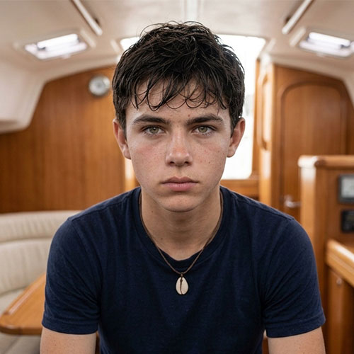

# Mateo Martínez — Ficha de personaje
### El Eco de las Mareas / The Echo of the Tides — MESA CHICA

Este archivo se va actualizando cada vez que definimos algo nuevo sobre Mateo. Es el documento de referencia único para él — para generación de imágenes, voz, o cualquier herramienta (incluido Google Flow).

**Edad confirmada: 15 años.** (Historial: la ficha visual original decía 16 y el PDF del argumento decía 17 — ya no aplican, esta ficha de personaje es la fuente de verdad actual.)

---


*Ficha visual de referencia subida por el equipo.*

## Datos básicos

- **Nombre completo:** Mateo Martínez
- **Edad:** 15 años
- **Rol en la historia:** Hijo mayor de Tomás y Clara. Estudiante de Programación y Lógica Cúbit. Acompaña a su familia en la travesía. Está aprendiendo a tomar responsabilidades y a confiar en sí mismo.
- **Familia:** Hijo de Tomás Martínez (45) y Clara Martínez (42). Hermano mayor de Sofía (9).
- **Habilidad:** talento innato para la arquitectura de código y la reconfiguración de software en entornos no estandarizados.
- **Debilidad:** "ansiedad del futuro" y apatía cínica, alimentada por la sobreexposición a narrativas alarmistas de redes y medios residuales.
- **Rol en el conflicto / resolución:** arco de transformación. Pasa de la parálisis y la apatía en el camarote a sentarse frente a la consola analógica del barco, adaptando su código para escribir el parche definitivo que libera al Nodo Ancla 7 de la encriptación corporativa.

## Apariencia física

Pelo oscuro ondulado y despeinado (efecto "mojado" natural), ojos color avellana-verdoso claro, piel clara con pecas leves, contextura delgada y juvenil, mirada profunda pero de gesto contenido.

**Vestuario habitual:** remera azul marino lisa, reloj deportivo negro, collar con un dije de caracol/concha. Ropa práctica y cómoda, apropiada para la vida en el mar.

### Estados a lo largo de la película (progresión física)

Misma lógica que con Tomás y Clara — prolijo al principio, cada vez más desaliñado con la tormenta.

**Estado prolijo (escenas 1 a 4 — asado, zarpando, el bloqueo):**
```
Hair neatly tousled but dry and clean, calm but slightly bored or distracted expression, clean
navy t-shirt, relaxed teenage posture.
```

**Estado desaliñado (escenas 5 a 9 — motor de repuesto, tormenta, cerco, clímax, regreso):**
```
Wind-blown wet hair sticking to his forehead, damp navy t-shirt, pale with worry and physical
exhaustion, tense hunched posture from working at the console.
```

## Personalidad

Inteligente, observador y reservado. Protector con su hermana. Le cuesta expresar lo que siente, pero es leal y de confianza.

- **Fortalezas:** resiliente, ingenioso, buen juicio, aprende rápido y es muy leal a su familia.
- **Debilidades:** tiende a guardarse las cosas, le cuesta pedir ayuda, impaciente ante la autoridad.
- **Objetivo:** demostrar que está listo para más responsabilidades y encontrar su propio lugar en el mundo.
- **Miedo:** fallarles a su familia o no estar a la altura de las circunstancias.

## Backstory / contexto narrativo

Encarna el "pesimismo honesto" del equipo — el arco temático central de la película. Vive el *Mean World Syndrome*: el pesimismo estructural inculcado por años de consumo de medios diseñados para generar miedo. Su arco es superarlo: descubrir que su habilidad con el código puede cambiar algo real, no solo procesar información. Es quien, bajo presión y sin señal, termina escribiendo el parche que reinicia el nodo — usando el mapa físico de su abuelo en vez de la tecnología que siempre desconfió.

## Notas visuales de la ficha oficial

- Estética realista, natural, sin artificios.
- Vestimenta práctica y cómoda, apropiada para la vida en el mar.
- Mirada profunda, gesto contenido.
- Presencia juvenil pero con un aire de responsabilidad.
- **Paleta de colores de referencia:** navy oscuro, azul acero, verde oliva, marrón cuero, cobre, beige/crema — la misma paleta de referencia que Tomás y que el look fijo cálido/cobre del proyecto.

## Voz

**Perfil base:** voz de adolescente de 15, registro medio, todavía en transición hacia una voz adulta — no tan grave como Tomás, con algo de aspereza natural de la edad. Tono generalmente contenido, cortante cuando está incómodo.

### Registro 1 — Apatía adolescente (el asado, 0:20–0:45)
```
Male teenage voice, 15 years old, neutral Rioplatense Spanish accent, voice still settling into 
adulthood. Bored, mildly annoyed, deadpan delivery, minimal energy. Stability: high. Style 
exaggeration: low.
```
Línea: *"Otra vez carne con gusto a alga..."*

### Registro 2 — Pánico inicial (el bloqueo, 1:00–1:20)
```
Male teenage voice, 15 years old, neutral Rioplatense Spanish accent. Genuine alarm breaking 
through his usual reserve, voice cracking slightly under stress, faster pace. Stability: low. Style 
exaggeration: high.
```
Línea: *"¡Los motores digitales no responden! ¡Estamos varados!"*

### Registro 3 — Frustración técnica (frente a la consola, 1:40–2:10)
```
Male teenage voice, 15 years old, neutral Rioplatense Spanish accent. Frustrated, scared but 
trying to sound capable, tight and clipped, an edge of self-doubt underneath the words. 
Stability: medium-low. Style exaggeration: medium-high.
```
Línea: *"¡No puedo vencer su algoritmo desde acá!"*

### Registro 4 — Alarma bajo tormenta (2:05–2:20)
```
Male teenage voice, 15 years old, neutral Rioplatense Spanish accent. Sharp, urgent shout, 
adrenaline audible, but still a teenager's voice — not as deep or controlled as Tomás's shouts. 
Stability: low. Style exaggeration: high.
```
Línea: *"¡Nos atacan!"*

### Registro 5 — Alivio callado (el clímax, 2:30–2:45)
```
Male teenage voice, 15 years old, neutral Rioplatense Spanish accent. Quiet triumph, exhausted 
relief, the first time all trailer he sounds calm and sure of himself. Slow pace, soft volume. 
Stability: high. Style exaggeration: low.
```
Línea: *"Open source... restored. The sea belongs to everyone again."*

## Prompts de imagen ya generados (por escena del tráiler)

Ver `prompts_imagenes_el_eco_de_las_mareas.md` y `prompts_dobles_por_plano.md` — todas las escenas donde aparece Mateo usan el descriptor fijo: *"Mateo Martínez (15, dark wavy tousled hair, light hazel-green eyes, fair skin with light freckles, lean build, navy t-shirt, black sports watch, shell-pendant necklace)"*.

## Prompts de prueba — planos individuales para testear el personaje

Todos parten del mismo descriptor fijo. Se apoyan además en el look fijo del proyecto (lente anamórfico 35mm, iluminación cinematográfica moody, paleta teal y cobre, niebla volumétrica) — ver `prompts_dobles_por_plano.md` para el bloque completo del look.

### 1. Retrato neutro (base)
```
Portrait shot, front-facing, neutral expression. Mateo Martínez, 15 years old, dark wavy tousled
hair, light hazel-green eyes, fair skin with light freckles, lean teenage build, wearing a plain
navy t-shirt, black sports watch, small shell-pendant necklace. Soft even lighting, wooden boat
cabin interior background, softly blurred. Photorealistic, shallow depth of field, 85mm portrait lens.
```

### 2. Perfil 3/4
```
Three-quarter profile shot of Mateo Martínez (15, dark wavy tousled hair, light hazel-green
eyes, fair skin with light freckles, navy t-shirt). Reserved, slightly distracted expression,
looking off-camera. Photorealistic, natural daylight, 85mm lens.
```

### 3. Perfil de costado
```
Full side profile shot of Mateo Martínez (15, dark wavy tousled hair, light hazel-green eyes,
fair skin with light freckles, navy t-shirt), against a plain neutral background. Photorealistic,
even studio-style lighting, sharp focus on facial structure.
```

### 4. Espalda / detalle de pelo
```
Back-of-head shot of Mateo Martínez showing his dark wavy tousled hair, slightly damp look.
Navy t-shirt visible on shoulders. Soft natural light, photorealistic, shallow depth of field.
```

### 5. Expresión — apatía / aburrimiento
```
Close-up portrait of Mateo Martínez (15, dark wavy tousled hair, light hazel-green eyes, fair
skin with light freckles, navy t-shirt), bored, slightly annoyed expression, eyes rolled subtly.
Bright daylight, photorealistic, shallow depth of field.
```

### 6. Expresión — pánico contenido
```
Close-up portrait of Mateo Martínez (15, dark wavy tousled hair, light hazel-green eyes, fair
skin with light freckles, navy t-shirt), pale, eyes wide with barely-contained panic, jaw tense.
Cold dim lighting, photorealistic, cinematic close-up.
```

### 7. Expresión — concentración bajo presión
```
Close-up portrait of Mateo Martínez (15, dark wavy tousled hair damp with sweat, light
hazel-green eyes, fair skin with light freckles, navy t-shirt), intensely focused, brow furrowed,
lit by a single work lamp. Dim warm light against cold darkness, photorealistic, cinematic.
```

### 8. Expresión — alivio / determinación final
```
Close-up portrait of Mateo Martínez (15, dark wavy tousled hair rain-soaked, light hazel-green
eyes, fair skin with light freckles, navy t-shirt), a small exhausted smile of relief and quiet
pride. Warm turquoise glow reflected on his face, photorealistic, shallow depth of field.
```

### 9. Cuerpo entero — en la consola
```
Full body shot of Mateo Martínez (15, dark wavy tousled hair, light hazel-green eyes, fair skin
with light freckles, lean build, navy t-shirt, black sports watch, shell-pendant necklace) hunched
over an analog console covered in hand-drawn code schematics, cables and switches, on board
the Benteveo — a 30-foot modern planing-hull sailboat with a WHITE FIBERGLASS HULL (not
wood-planked, not an antique ship), 40 years old but lovingly, impeccably maintained by the
family. Dim work-lamp lighting, cinematic, photorealistic.
```

### 10. Detalle — ojos y pecas
```
Extreme close-up macro shot of Mateo Martínez's light hazel-green eyes, light freckles visible
across the nose and cheeks, sharp focus on iris texture. Natural soft light, photorealistic, macro
lens detail.
```

### 11. Detalle — collar y reloj
```
Close-up detail shot of Mateo Martínez's small shell-pendant necklace and black sports watch,
resting against the navy t-shirt fabric. Natural daylight, photorealistic, macro lens, shallow
depth of field.
```

## Ficha para Google Flow (formato compacto)

```
Nombre: Mateo Martínez
Edad: 15 años
Rol: Hijo mayor de Tomás y Clara Martínez, hermano de Sofía. Acompaña a su familia en la
travesía en el Benteveo.

Apariencia física: Pelo oscuro ondulado y despeinado, ojos color avellana-verdoso claro, piel
clara con pecas leves, contextura delgada y juvenil. Viste remera azul marino lisa, reloj
deportivo negro, collar con dije de caracol.

Personalidad: Inteligente, observador y reservado. Protector con su hermana. Le cuesta
expresar lo que siente, pero es leal y de confianza. Tiende a guardarse las cosas y le cuesta
pedir ayuda. Su objetivo es demostrar que está listo para más responsabilidades.

Contexto narrativo: Encarna el escepticismo tecnológico y el "Mean World Syndrome" del guion
— su arco es superar el miedo inculcado por los medios y descubrir que su conocimiento
técnico puede salvar a su familia cuando la tecnología digital falla.
```
