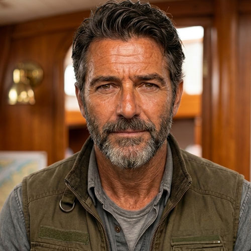
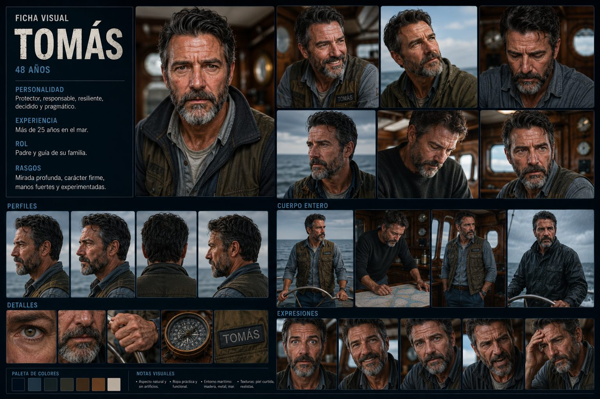

# Tomás Martínez — Ficha de personaje
### El Eco de las Mareas / The Echo of the Tides — MESA CHICA

Este archivo se va actualizando cada vez que definimos algo nuevo sobre Tomás. Es el documento de referencia único para él — para generación de imágenes, voz, o cualquier herramienta (incluido Google Flow).

---


*Ficha visual de referencia subida por el equipo.*


*Ficha visual completa de Tomás (referencia del equipo) — ficha completa con perfiles, expresiones, cuerpo entero y detalles.*

## Datos básicos

- **Nombre completo:** Tomás Martínez
- **Edad:** 45 años
- **Rol en la historia:** Padre y guía de la familia. Ingeniero Hidráulico y Capitán del Benteveo. Más de 25 años en el mar — es quien mantiene y conoce al Benteveo por dentro y por fuera, incluido el motor de repuesto que guardan bajo cubierta.
- **Familia:** Esposo de Clara Martínez (42). Padre de Mateo (15) y Sofía (9).
- **Habilidad:** maestría absoluta en mecánica analógica y sistemas hidráulicos de redundancia — estratega técnico en entornos de baja o nula tecnología digital.
- **Debilidad:** escepticismo hacia los sistemas 100% automatizados, lo que a veces genera tensión previa con la visión más moderna de Clara o las tendencias de Mateo.
- **Rol en el conflicto / resolución:** capitán operativo. Domina la navegación física del Benteveo en medio del bloqueo de frecuencias y la tormenta sintética. Repara la biela mecánica bajo el oleaje y dictamina los puntos ciegos de los sistemas hostiles usando los esquemas analógicos en papel que dejó su suegro, Vicente.

## Apariencia física

Pelo oscuro con canas leves solo en las sienes (no completamente canoso), barba corta prolijamente recortada con algo de gris en el mentón, ojos marrones profundos, piel con buen color por el sol y el mar, sin arrugas marcadas — se nota que tiene 45, no más. Manos fuertes y experimentadas, mirada profunda, carácter firme.

**Vestuario habitual:** chaleco utilitario verde oliva, sobre camisa gris o de jean. Ropa práctica y funcional, sin artificios, pensada para trabajar a bordo.

### Estados a lo largo de la película (progresión física)

El aspecto de Tomás cambia con la travesía — prolijo al principio, cada vez más desaliñado a medida que pelea contra la tormenta. Usar el descriptor que corresponda según la escena.

**Estado prolijo (escenas 1 a 4 — asado, zarpando, el bloqueo):**
```
Neatly combed dark hair with light grey only at the temples, short well-groomed beard, calm
composed expression, clean and slightly pressed olive-green vest, relaxed confident posture.
```

**Estado desaliñado (escenas 5 a 9 — motor de repuesto, tormenta, cerco, clímax, regreso):**
```
Wind-blown wet hair sticking to his forehead, beard damp and unkempt, rain and sweat on his
face, vest soaked and rumpled, exhausted but determined expression, sleeves pushed up.
```

## Personalidad

Protector, responsable, resiliente, decidido y pragmático. Es la mano que arregla lo que hace falta arreglar — la ancla técnica y emocional de la familia. Piensa en soluciones concretas antes que en explicaciones largas.

- **Rol funcional en el guion:** el que resuelve los problemas mecánicos del Benteveo bajo presión (el motor de repuesto, las reparaciones en plena tormenta). Su competencia técnica es lo que mantiene a la familia con vida cuando la tecnología digital falla.

## Backstory / contexto narrativo

Ingeniero de formación. Esposo de Clara, con quien comparte la vida en Mar del Plata y el vínculo con el Benteveo, heredado de la familia de ella (el barco del abuelo Vicente). En sus años con la familia se volvió quien mejor conoce al barco por dentro — el motor de repuesto que salva a la familia durante el sabotaje de Vortex es, en gran parte, mérito de su cuidado constante.

## Notas visuales de la ficha oficial

- Estética realista, natural, sin artificios.
- Entorno maritimo constante: madera, metal, mar.
- Texturas de piel curtidas y realistas.
- **Paleta de colores de referencia:** navy oscuro, azul acero, verde oliva, marrón cuero, cobre, beige/crema — coincide con el look fijo cálido/cobre que ya usamos en todos los prompts del proyecto.

## Voz

**Perfil base:** registro grave, cálido pero firme, acento rioplatense neutro. Voz de alguien que resuelve problemas con las manos antes que con palabras — frases cortas, directas, sin adornos. Nunca grandilocuente.

### Registro 1 — Padre cálido (el asado, 0:20–0:45)
```
Male voice, 45 years old, neutral Rioplatense Spanish accent. Warm, cheerful father tone, 
relaxed pace, a hint of playful pride. Deep chest resonance but light and easygoing in this 
scene. Stability: medium. Style exaggeration: medium — allow natural warmth and a small laugh.
```
Línea: *"Carne de carbono negativo, hijo. Tu abuelo pagaría por probar esto. Ponele chimichurri. Sofi, decile a mamá que deje de trabajar."*

### Registro 2 — Alarma inicial (el bloqueo, 1:00–1:20)
```
Male voice, 45 years old, neutral Rioplatense Spanish accent. Confused, alert, the first crack in 
his calm. Short clipped delivery, slightly faster pace than his baseline. Stability: medium-low. 
Style exaggeration: medium.
```
Línea: *"¿Qué sucede?"*

### Registro 3 — Determinación pragmática (el motor de repuesto, 1:20–1:40)
```
Male voice, 45 years old, neutral Rioplatense Spanish accent. Low, steady, resolved — a man 
who has already decided what to do and is now just doing it. Minimal inflection, almost flat with 
quiet confidence underneath. Stability: high. Style exaggeration: low.
```
Línea: *"Si lo digital no funciona... la historia puede que sí."*

### Registro 4 — Esfuerzo físico (la tormenta, 1:40–2:10)
```
Male voice, 45 years old, neutral Rioplatense Spanish accent. Raw physical strain under rain and 
wind — grunting effort audible, urgent but not panicked. Slight vocal roughness from exertion, 
diction still clear. Stability: low. Style exaggeration: high.
```
Línea: *"¡Oh por Dios!"*

### Registro 5 — Protector, grave (mirando al cielo, 1:20)
```
Male voice, 45 years old, neutral Rioplatense Spanish accent. Grave, quiet warning tone — the 
weight of realizing there's a second problem coming. Slow deliberate pace, low volume. 
Stability: high. Style exaggeration: low.
```
Línea: *"No es el único problema..."*

## Prompts de imagen ya generados (por escena del tráiler)

Ver `prompts_imagenes_el_eco_de_las_mareas.md` y `prompts_dobles_por_plano.md` — todas las escenas donde aparece Tomás usan el descriptor fijo: *"Tomás Martínez (45, dark hair with light grey at the temples, short well-groomed beard, deep brown eyes, sun-kissed skin, olive-green utility vest)"*.

## Prompts de prueba — planos individuales para testear el personaje

Todos parten del mismo descriptor fijo. Se apoyan además en el look fijo del proyecto (lente anamórfico 35mm, iluminación cinematográfica moody, paleta teal y cobre, niebla volumétrica) — ver `prompts_dobles_por_plano.md` para el bloque completo del look.

### 1. Retrato neutro (base)
```
Portrait shot, front-facing, neutral expression. Tomás Martínez, 45 years old, dark hair with light grey at the temples,
short well-groomed beard, deep brown eyes, sun-kissed skin, wearing an olive-green
utility vest over a grey shirt. Soft even lighting, wooden boat
cabin interior background, softly blurred. Photorealistic, shallow depth of field, 85mm portrait lens.
```

### 2. Perfil 3/4
```
Three-quarter profile shot of Tomás Martínez (45, dark hair with light grey at the temples, short well-groomed beard,
deep brown eyes, sun-kissed skin, olive-green vest). Calm, firm
expression, looking slightly off-camera toward the sea. Photorealistic, natural daylight, 85mm lens.
```

### 3. Perfil de costado
```
Full side profile shot of Tomás Martínez (45, dark hair with light grey at the temples, short well-groomed beard, sun-kissed
tan skin, olive-green vest), against a plain neutral background.
Photorealistic, even studio-style lighting, sharp focus on facial structure and beard texture.
```

### 4. Espalda / detalle de pelo
```
Back-of-head shot of Tomás Martínez showing his dark hair with light grey at the temples, slightly wind-blown. Olive-
green vest visible on shoulders. Soft natural light, photorealistic, shallow depth of field.
```

### 5. Expresión — determinación firme
```
Close-up portrait of Tomás Martínez (45, dark hair with light grey at the temples, short well-groomed beard, deep brown
eyes, sun-kissed skin, olive-green vest), jaw set, steady determined
gaze into camera. Dramatic side lighting, stormy blue-grey backdrop, photorealistic, cinematic.
```

### 6. Expresión — calidez / sonrisa
```
Close-up portrait of Tomás Martínez (45, dark hair with light grey at the temples, short well-groomed beard, sun-kissed
tan skin, olive-green vest), warm relaxed smile, laugh lines around the
eyes. Bright daylight, warm color temperature, photorealistic, shallow depth of field.
```

### 7. Expresión — esfuerzo físico
```
Close-up portrait of Tomás Martínez (45, dark hair with light grey at the temples, short well-groomed beard, sun-kissed
tan skin, olive-green vest), straining with physical effort, gritted teeth,
sweat and rain on his face. Dim, dramatic lighting, photorealistic, cinematic close-up.
```

### 8. Expresión — preocupación contenida
```
Close-up portrait of Tomás Martínez (45, dark hair with light grey at the temples, short well-groomed beard, sun-kissed
tan skin, olive-green vest), brow furrowed, worried but composed,
looking upward toward the sky. Cool overcast light, photorealistic, shallow depth of field.
```

### 9. Cuerpo entero — al timón
```
Full body shot of Tomás Martínez (45, dark hair with light grey at the temples, short well-groomed beard, sun-kissed
skin, olive-green utility vest, dark trousers, boots) standing firmly at
the wheel of the Benteveo — a 30-foot modern planing-hull sailboat with a WHITE FIBERGLASS
HULL (not wood-planked, not an antique ship), 40 years old but lovingly, impeccably maintained by the family (never neglected or dirty), registration number
"620772" near the bow. He is in the OPEN-AIR COCKPIT AT THE STERN, exposed to sky and sea
— there is no enclosed wheelhouse or indoor helm of any kind. He grips a single modern-size
sailing wheel with a teak-veneer rim on a slim pedestal, in its correct normal orientation (the
compass console faces him, never mirrored or backwards), hands on the spokes, upright confident
posture. Wide shot, natural daylight, open ocean visible all around, composite deck with minor
teak trim accents, photorealistic.
```

### 10. Detalle — manos y timón
```
Close-up detail shot of Tomás Martínez's strong, weathered hands gripping a modern-size
sailing wheel with a teak-veneer rim (on the Benteveo, a fiberglass-hulled modern sailboat, open
cockpit at the stern — not an ornate ship's wheel, not an enclosed wheelhouse), veins and
calluses visible, wedding ring on one hand. Natural daylight, open ocean visible behind,
photorealistic, macro lens, shallow depth of field.
```

### 11. Detalle — ojos
```
Extreme close-up macro shot of Tomás Martínez's deep brown eyes, weathered skin with fine
expression lines at the corners, sharp focus on the iris texture. Natural soft light,
photorealistic, macro lens detail.
```

## Ficha para Google Flow (formato compacto)

```
Nombre: Tomás Martínez
Edad: 45 años
Rol: Padre y guía de la familia Martínez. Ingeniero, más de 25 años en el mar. Mantiene y
conoce al Benteveo por dentro y por fuera.

Apariencia física: Pelo oscuro con canas leves solo en las sienes, barba corta prolijamente
recortada, ojos marrones profundos, piel con buen color por el sol y el mar, sin arrugas
marcadas — aparenta los 45 años que tiene. Manos fuertes y experimentadas. Viste un chaleco
utilitario verde oliva, sobre camisa gris o de jean.

Personalidad: Protector, responsable, resiliente, decidido y pragmático. Resuelve problemas
concretos antes que dar explicaciones largas. Es la ancla técnica y emocional de la familia.

Contexto narrativo: Esposo de Clara Martínez, padre de Mateo y Sofía. Su conocimiento
mecánico del Benteveo —heredado de años de cuidado del barco— es lo que salva a la familia
cuando la tecnología digital falla durante el sabotaje de Vortex Corp.
```
